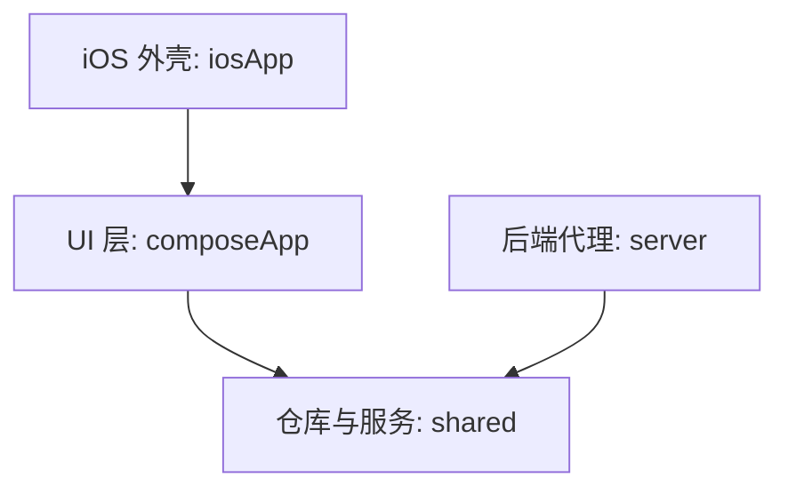

# UBAA 项目文档

## 1. 项目概览
UBAA 是一个采用 Kotlin Multiplatform (KMP) 技术构建的项目，旨在为 Android、iOS、桌面端和 Web 端提供统一的体验。项目深度集成了北航 SSO 登录以及教务系统（课表、考试、博雅课程）。

### 架构设计
- **分层架构**：UI 层 (`composeApp`)、业务逻辑与仓库层 (`shared`)、后端代理层 (`server`)。
- **核心策略**：通过 `shared` 模块和 Compose Multiplatform 实现“一次编写，到处运行”。

### 模块结构
| 模块 | 路径 | 描述 |
| :--- | :--- | :--- |
| **shared** | `shared/` | 核心业务逻辑、DTO 数据模型、模块化 API 服务及 Repository。 |
| **composeApp** | `composeApp/` | 基于 Compose Multiplatform 的共享 UI。包含 ViewModels 和导航逻辑。 |
| **server** | `server/` | 基于 Ktor 的后端服务，充当北航各类教务系统的会话代理。 |
| **iosApp** | `iosApp/` | 承载 iOS 版 `composeApp` 实现的 Xcode 项目。 |

## 2. 关键组件与实现

### A. 共享逻辑 (`shared`)
- **网络层 (`cn.edu.ubaa.api`)**:
    - `NetworkUtils.kt`: 包含 `safeApiCall` 泛型函数，用于统一异常处理、HTTP 状态码检查及 `Result<T>` 包装。
    - `AuthService.kt`, `ScheduleService.kt`, `BykcService.kt`: 按业务领域拆分的模块化服务类。
    - `ApiClient.kt`: 跨平台 Ktor HTTP 客户端配置。
- **仓库层 (`cn.edu.ubaa.repository`)**:
    - `TermRepository.kt`: 学期数据的集中数据源，支持内存缓存，供多个 ViewModel 复用。
- **数据模型 (`cn.edu.ubaa.model.dto`)**: 前后端完全共享的 DTO 定义（包含认证、博雅、考试、课表、用户信息）。

### B. 用户界面 (`composeApp`)
UI 完全由 Compose 构建，导航和状态逻辑已与具体屏幕解耦。

**导航与布局**:
- `NavigationController.kt`: 管理应用的回退栈 (`navStack`) 和路由逻辑。
- `MainAppScreen.kt`: 登录后的主容器。集成 `NavigationController` 和统一的 `AppTopBar`。
- `components/AppTopBar.kt`: 标准化顶栏，支持根据页面层级自动切换“菜单/回退”图标。

**主要屏幕与 ViewModel**:
- **首页**: `HomeScreen` + `ScheduleViewModel`（展示今日课程）。
- **课表**: `ScheduleScreen` + `ScheduleViewModel`（周视图网格）。
- **考试**: `ExamScreen` + `ExamViewModel`（按状态分组的考试列表）。
- **博雅**: 包含列表、详情及选课管理的一系列模块化屏幕。

### C. 后端服务 (`server`)
作为北航教务系统的安全代理，处理复杂的会话和加密逻辑。

- **认证机制**:
  - **JWT**: 客户端与代理服务器之间的无状态认证。
  - **SessionManager**: 服务端状态管理，维护与 SSO 的会话（Cookie 维护与 HttpClient 复用）。
- **路由组织**: 按功能划分路由（如 `/api/v1/auth`, `/api/v1/schedule`, `/api/v1/exam`, `/api/v1/bykc`）。

## 3. API 开发指南
- **基础路径**: 所有接口均以 `/api/v1/...` 开头。
- **错误处理**: 客户端调用务必使用 `safeApiCall`，以确保获得一致的 `Result<T>` 响应，并能解析标准的 `ApiErrorResponse` 错误信息。
- **认证**: 除登录和验证码接口外，所有请求头必须包含 `Authorization: Bearer <jwt_token>`。

## 4. 操作指南

### 构建与运行
- **Android**: `./gradlew :composeApp:installDebug`
- **桌面端**: `./gradlew :composeApp:run`
- **服务端**: `./gradlew :server:run`（开发环境内置默认密钥，生产环境请配置 `JWT_SECRET`）
- **Web 端**: `./gradlew :composeApp:jsBrowserDevelopmentRun`

### 功能参考：考试查询
- **接口**: `GET /api/v1/exam/list?termCode={termCode}`
- **数据模型**: `ExamArrangementData` 包含 `arranged`（已安排）和 `notArranged`（未安排）列表。
- **入口**: 应用内“普通功能” -> “考试查询”。

## 5. 项目优化记录 (2025-12-20)

### 依赖管理
- 统一使用 `gradle/libs.versions.toml` 管理依赖版本，移除了模块构建文件中硬编码的版本号。
- 添加了 `java-jwt`, `sqlite-jdbc`, `multiplatform-settings` 等缺失的 Version Catalog 定义。

### 安全性与后端架构
- **JWT 安全**: 在 `JwtUtil.kt` 中添加了针对未设置 `JWT_SECRET` 环境变量的强警告日志。
- **性能优化**: 
    - 修复了 `AuthRoutes.kt` 中每次请求验证码都创建新 `HttpClient` 的问题，改为使用 `HttpClients.sharedClient`。
    - 引入了 `HttpClients.kt` 单例对象管理无状态内部请求的 HTTP 客户端。

### 共享逻辑 (Shared)
- **网络层**: `NetworkUtils.kt` 新增了对 `422 UnprocessableEntity` 状态码的处理，支持正确解析并抛出 `CaptchaRequiredException`，修复了前端无法识别验证码挑战的问题。
- **并发安全**: `TermRepository.kt` 引入了 `Mutex` 双重检查锁定，解决了并发调用 `getTerms` 可能导致多次网络请求的竞态条件。

### UI 性能 (ComposeApp)
- **渲染优化**: `ScheduleScreen.kt` 中的 `CourseCell` 组件现已使用 `remember` 缓存颜色解析结果，避免了在重组期间重复解析十六进制颜色字符串的开销。

### 代码质量与工程化
- **注释汉化**: 核心业务代码（Server/Shared/ComposeApp）的注释已全面汉化，统一使用简体中文，遵循“解释原因而非过程”的原则，降低了维护门槛。
- **Git 配置**: 更新了 `.gitignore` 文件，细化了针对 Kotlin Multiplatform、Android、iOS 和 Gradle 的忽略规则，移除了冗余项，确保仓库整洁。
