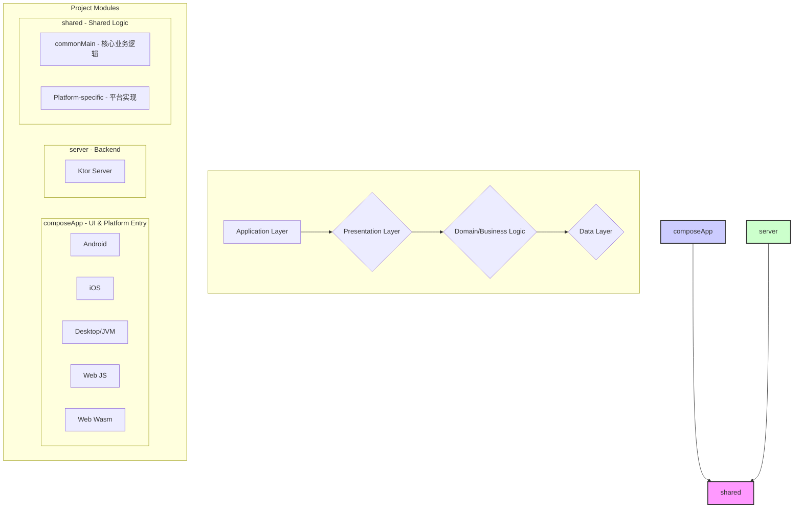
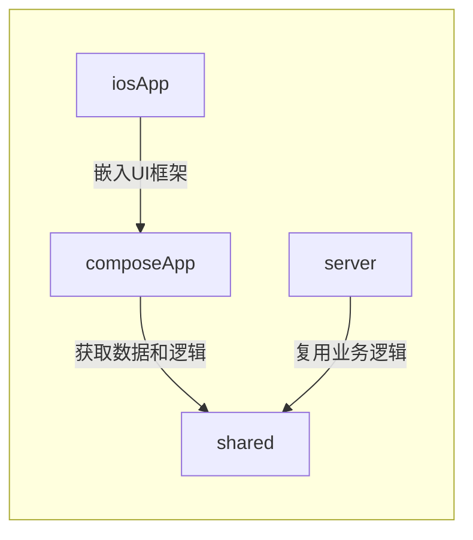
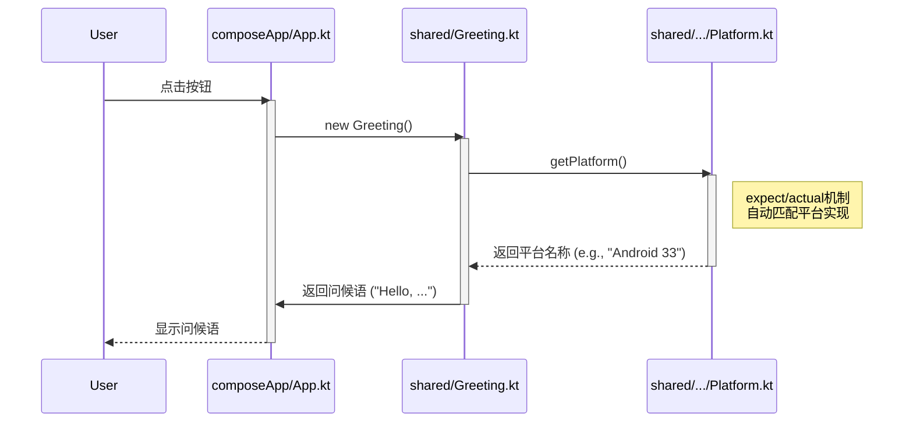

## **UBAA 项目 AI 解析文档**

### **1. 项目架构概览**

本项目采用典型的 Kotlin Multiplatform 架构，通过分层和模块化实现代码共享与平台特异性开发。其核心思想是 **“一次编写，多处运行”**。

**架构解读:**

* **`shared` 模块**: 项目的核心。包含了所有平台（Android, iOS, Web, Desktop, Server）共享的业务逻辑和数据处理代码。
  * `commonMain`: 存放纯 Kotlin 代码，与平台无关，例如数据模型、网络请求、业务逻辑等。
  * `androidMain`, `iosMain`, `jvmMain`, `jsMain`, `wasmJsMain` 等: 存放需要调用特定平台 API 的代码，通过 `expect/actual` 机制实现平台差异化。
* **`composeApp` 模块**: 负责构建用户界面 (UI)。它使用 Jetpack Compose for Multiplatform 技术，将 UI 代码在 Android, iOS, Desktop, Web 之间共享。
* **`server` 模块**: 一个独立的 Ktor 服务器应用，可以为客户端 App 提供 API 服务。它也依赖 `shared` 模块来复用业务逻辑。
* **`iosApp` 目录**: 存放 Xcode 项目，是 iOS 应用的入口和容器，负责加载 `composeApp` 模块编译出的 `ComposeApp.framework`。

### **2. 代码文件依赖关系**

模块间的依赖关系是理解项目结构的关键。

| 模块 (Module)                 | 依赖于 (Depends on) | 描述                                                                                                 |
| ----------------------------- | ------------------- | ---------------------------------------------------------------------------------------------------- |
| **`composeApp`**              | `shared`            | UI 层，依赖 `shared` 模块来获取数据和执行业务逻辑。                                                  |
| **`server`**                  | `shared`            | 后端服务，同样依赖 `shared` 模块来处理业务逻辑，确保前后端逻辑一致性。                               |
| **`shared`**                  | (无内部项目依赖)    | 核心逻辑模块，不依赖任何其他项目模块，保证其独立性和可移植性。                                       |
| **`iosApp (Xcode)`**          | `composeApp`        | iOS 应用的壳，通过 Xcode build phase 脚本编译并嵌入 `composeApp` 模块生成的 `ComposeApp.framework`。 |
| **Root (`build.gradle.kts`)** | -                   | 管理所有子模块的插件版本和应用，但不直接参与代码逻辑。                                               |

**依赖图:**

### **3. 功能模块调用逻辑**

以一个典型的“问候”功能为例，展示其在不同模块间的调用流程。

**流程描述:**

1. **UI 触发 (composeApp)**: 用户在 `App.kt` 中点击按钮。
2. **调用共享逻辑**: `App.kt` 创建 `Greeting` 类的实例（该类位于 `shared/commonMain`）。
3. **平台判断 (shared)**: `Greeting` 类内部通过 `getPlatform()` 函数获取当前运行平台的信息。
4. **`expect/actual` 解析**:
   * `getPlatform()` 在 `shared/commonMain` 中被声明为 `expect fun`。
   * Kotlin 编译器会根据当前编译的目标平台，自动链接到对应的 `actual fun` 实现。例如，在 Android 上会链接到 `shared/androidMain` 中的 `Platform.android.kt`。
5. **返回平台信息**: 对应的 `actual` 实现返回平台特定的字符串 (如 "Android 33")。
6. **生成问候语**: `Greeting` 类将平台信息拼接成最终的问候语 "Hello, Android 33!"。
7. **UI 渲染**: `composeApp` 将问候语渲染到屏幕上。

**调用时序图:**

### **4. 关键代码文件索引**

以下是项目中最重要的文件及其功能描述，便于 AI 快速定位和理解代码。

| 文件路径                                                          | 模块         | 功能描述                                                                                                                          |
| ----------------------------------------------------------------- | ------------ | --------------------------------------------------------------------------------------------------------------------------------- |
| `settings.gradle.kts`                                             | Root         | **项目模块定义**：声明项目中包含 `composeApp`, `server`, `shared` 三个核心模块。                                                  |
| `gradle/libs.versions.toml`                                       | Root         | **依赖库版本管理**：集中管理所有第三方库和插件的版本，实现统一控制。                                                              |
| `shared/src/commonMain/kotlin/cn/edu/ubaa/Platform.kt`            | `shared`     | **平台差异化接口 (expect)**：定义了获取平台信息的 `expect` 接口，由各平台模块实现。                                               |
| `shared/src/androidMain/kotlin/cn/edu/ubaa/Platform.android.kt`   | `shared`     | **平台差异化实现 (actual)**：提供了 `getPlatform()` 在 Android 平台的具体实现。                                                   |
| `shared/src/iosMain/kotlin/cn/edu/ubaa/Platform.ios.kt`           | `shared`     | **iOS 平台实现 (actual)**：提供了 `getPlatform()` 在 iOS 平台的具体实现。                                                         |
| `shared/src/jvmMain/kotlin/cn/edu/ubaa/Platform.jvm.kt`           | `shared`     | **JVM 平台实现 (actual)**：提供了 `getPlatform()` 在 JVM/Desktop 平台的具体实现。                                                 |
| `shared/src/commonMain/kotlin/cn/edu/ubaa/Greeting.kt`            | `shared`     | **核心业务逻辑**：实现了与平台无关的问候功能，是共享逻辑的核心。                                                                  |
| `shared/src/commonMain/kotlin/cn/edu/ubaa/Constants.kt`           | `shared`     | **共享常量定义**：定义了跨平台共享的常量，如服务器端口等配置信息。                                                                |
| `composeApp/src/commonMain/kotlin/cn/edu/ubaa/App.kt`             | `composeApp` | **共享 UI 入口**：定义了所有客户端（Android, iOS, Desktop, Web）共享的 Compose UI 界面。                                          |
| `composeApp/build.gradle.kts`                                     | `composeApp` | **多平台编译配置**：配置了 Kotlin Multiplatform 插件，定义了所有需要编译的目标平台。                                              |
| `composeApp/src/androidMain/kotlin/cn/edu/ubaa/MainActivity.kt`   | `composeApp` | **Android 应用入口**：Android App 的 `Activity`，负责加载 `App()` 这个共享 Composable。                                           |
| `composeApp/src/iosMain/kotlin/cn/edu/ubaa/MainViewController.kt` | `composeApp` | **iOS UI 控制器**：为 iOS 平台提供 Compose UI 的 ViewController 包装器。                                                          |
| `composeApp/src/jvmMain/kotlin/cn/edu/ubaa/main.kt`               | `composeApp` | **Desktop 应用入口**：JVM/Desktop 平台的应用程序入口点。                                                                          |
| `iosApp/iosApp/ContentView.swift`                                 | `iosApp`     | **iOS UI 桥接**：通过 `UIViewControllerRepresentable` 将 Kotlin Multiplatform 生成的 `MainViewController` 嵌入到 SwiftUI 视图中。 |
| `server/src/main/kotlin/cn/edu/ubaa/Application.kt`               | `server`     | **服务器应用入口**：配置并启动 Ktor 服务器，定义 API 路由，并调用 `shared` 模块的逻辑，使用 `Constants.kt` 中定义的端口配置。     |

### **5. 常用设计模式与约定**

* **架构模式**:
  * **分层架构 (Layered Architecture)**: 明确划分 UI (`composeApp`)、业务逻辑 (`shared`) 和后端 (`server`)，实现了高内聚、低耦合。
  * **MVVM (Model-View-ViewModel)**: 虽然在当前简单示例中不明显，但 Compose 的设计鼓励使用 ViewModel 来管理 UI 状态和业务逻辑，`shared` 模块可以作为 ViewModel 的数据来源。

* **编码规范与约定**:
  * **`expect/actual` 机制**: 这是 Kotlin Multiplatform 的核心模式，用于处理平台特定 API 的调用。在 `commonMain` 中声明 `expect`，在平台特定的 sourceSet (如 `androidMain`, `iosMain`) 中提供 `actual` 实现。
  * **依赖注入 (Dependency Injection)**: 项目通过 Gradle 的模块依赖来管理耦合关系，这是一种广义上的依赖注入。在更复杂的场景中，可以引入 Koin 或 Hilt/Dagger 等 DI 框架。
  * **统一命名空间**: 项目使用 `cn.edu.ubaa` 作为统一的包名，便于代码管理和识别。
  * **版本目录 (Version Catalog)**: 使用 `gradle/libs.versions.toml` 文件来管理所有依赖项，这是 Gradle 推荐的最佳实践，可以避免版本冲突和方便升级。
